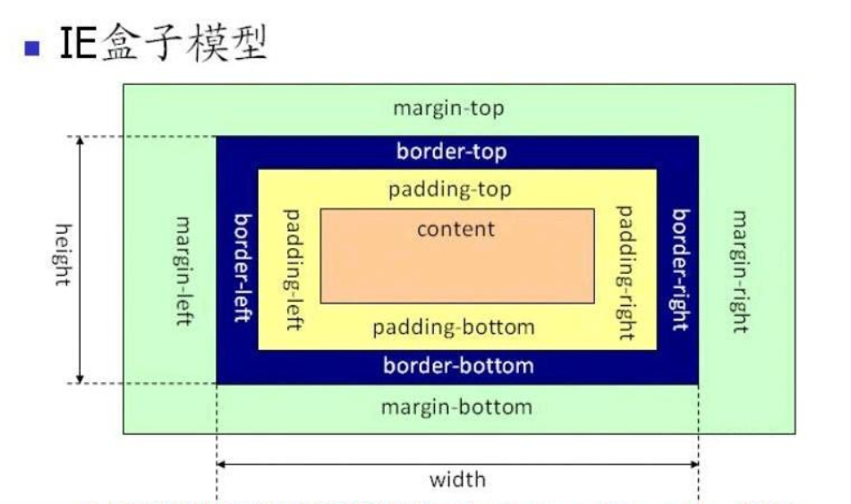

# 盒子模型

## 一、简介

所有 HTML 元素可以看作盒子，在 CSS 中，"box model" 这一术语是用来设计和布局时使用。CSS 盒模型本质上是一个盒子，封装周围的 HTML 元素，它包括：**边距，边框，填充，**和**内容**。

**盒子模型 (Box Model) 的基本结构：**


**内容说明：**

* Margin (外边距) - 清除边框外的区域，外边距是透明的。

* Border (边框) - 围绕在内边距和内容外的边框。

* Padding (内边距) - 清除内容周围的区域，内边距是透明的。

* Content (内容) - 盒子的内容，显示文本和图像。

> 注意：IE8 及更早IE版本不支持设置填充的宽度和边框的宽度属性。解决 IE8 及更早版本不兼容问题可以在HTML页面声明 ` <!DOCTYPE html>` 即可  

## 二、W3C 标准盒子模型和 IE 盒子模型

### 1、w3c 标准盒子模型


根据 W3C 的规范：元素内容占据的空间是由 width 属性设置的，而内容周围的 padding 和 border 值是另外计算的；所以在 W3C 规范下，盒子 content 宽高为 css 样式中设置的 width/height，盒子总宽/高= width / height + padding + border + margin。

### 2、IE 盒子模型



在 IE 盒子模型下，浏览器的 width 属性不是内容的宽度，而是内容、内边距和边框的宽度的总和；即 IE 盒子的 content + padding + border 宽高等于 css 样式中设置的 width / height，盒子总宽度/高度= width / height + margin = content 宽/高 + padding + border + margin。

### 3、W3C 与 IE 盒子模型转换

CSS3 开始提供了 box-sizing 属性可以指定盒子模型的种类:

* ```box-sizing:content-box``` : 指定盒子模型为 W3C 标准盒模型;

* ```box-sizing:border-box`` : 指定为IE盒子模型。