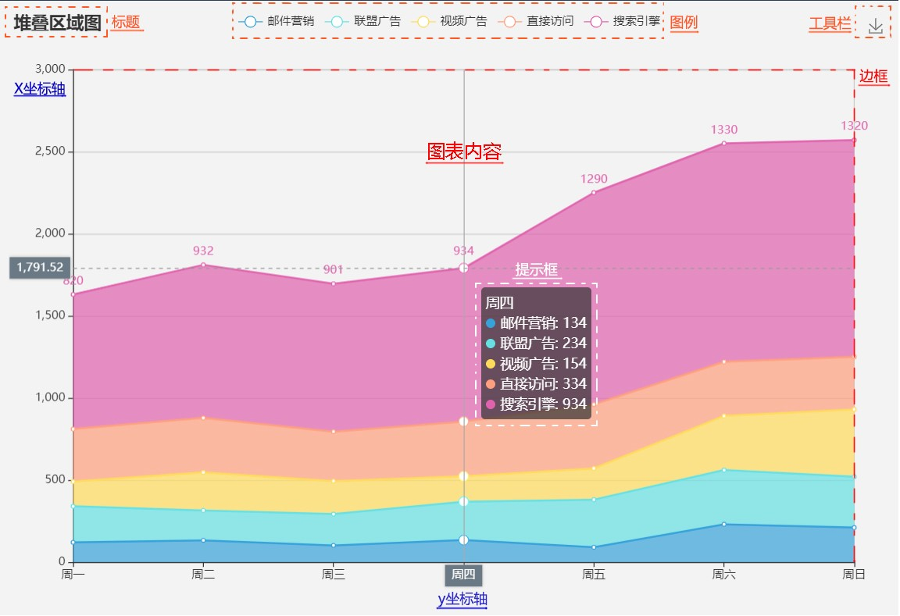

# Echarts 数据可视化

ECharts，是一个 JavaScript 的开源可视化库，可以流畅的运行在 PC 和移动设备上，提供直观，交互丰富，可高度个性化定制的数据可视化图表功能。

## 一、引入 Echarts

首先需要先将 Echarts 图表库，可以通过以下几种方式获取到 echarts 源码并在 web 项目中进行引入：

1. 从 Echarts 官网下载界面，将 Echarts 组件库源码下载到本地
2. 从 Echarts 的 Github 项目中获取组件库源码
3. 通过 [jsDelivr](https://www.jsdelivr.com/package/npm/echarts) 等 CDN 服务引入 

然后，通过 script 标签引入：

```html
<!--scrpit 标签引入-->
<script src=". /lib/echarts/echarts.min.js"></script>
<!--or-->
<script src="https: //cdn.jsdelivr.net/npm/echarts@4.9.0/dist/echarts.min.js"></script>

<!--图表容器-->
<div id="echartDiv"  style="width:600px;height: 400px;"></div>
<script>
    // 基于 echartDiv 容器，初始化 echarts 实例
    var myChart = echarts.init(document.getElementById('echartDiv'));
    // 图表配置项和数据
    var option = {
        title: { text: 'ECharts Demo' },
        tooltip: {},
        legend: {
            data: ['销量']
        },
        xAxis: {
            data: ["衬衫", "羊毛衫", "雪纺衫", "裤子", "高跟鞋"]
        },
        series: [{
            name: '销量',
            type: 'bar',
            data: [5, 20, 36, 10, 10]
        }]
    };
    // 根据配置信息绘制图表
    myChart.setOption(option);
</script>
```

也可以通过 npm 包的方式，将 Echarts 在本地进行安装，结合 webpack 等前端打包工具使用。

```js
const echarts = require('echarts');
const myChart = echarts.init(document.getElementById('echartDiv'));
// 绘制图表
myChart.setOption({
    title: { text: 'ECharts Demo' },
    tooltip: {},
    xAxis: {
        data: ['衬衫', '羊毛衫', '雪纺衫', '裤子', '高跟鞋']
    },
    yAxis: {},
    series: [{
        name: '销量',
        type: 'bar',
        data: [5, 20, 36, 10, 10]
    }]
});
```

import 方式按需引入

```js
// 引入 ECharts 主模块
import echarts from 'echarts/lib/echarts';
// 引入提示框和标题组件
import 'echarts/lib/component/tooltip';
import 'echarts/lib/component/title';
import 'echarts/lib/component/legend';
// 引入图表类型
import 'echarts/lib/chart/bar';
```

## 二、基本 API

项目中通过 script 标签引入 echarts.js 文件，或者在 amd 环境中通过 require('echarts') 可以获取到 echarts 原型对象，echarts 对象拥有以下一些属性和方法：

- init：创建并返回一个 echarts 图表实例
- connect：多个图表实例实现联动
- disconnect：解除图表实例的联动
- dispose：销毁实例，实例销毁后无法再被使用
- getInstance：获取页面上的 echarts 图表实例
- registerMap：注册可用地图，必须在包括 geo 组件或者 map 图表类型的时候才能使用

## 三、图表配置项

一个基本的图表通常由以下几部分组成：**标题、图例、工具栏、坐标轴、边框、提示框、图表内容**等。

 

**option 配置项**：

* **title**：标题组件，包含主标题和副标题。

* **legend**：图例组件。

- **tooltip**：提示框组件
- **grid**：直角坐标系内绘图网格，单个 grid 内最多可以放置上下两个 X 轴，左右两个 Y 轴。可以在网格上绘制折线图，柱状图，散点图（气泡图）
- **toolbox**：工具栏。内置有导出图片，数据视图，动态类型切换，数据区域缩放，重置五个工具。
- **xAxis**：直角坐标系 grid 中的 x 轴，一般情况下单个 grid 组件最多只能放上下两个 x 轴，多于两个 x 轴需要通过配置 offset 属性防止同个位置多个 x 轴的重叠。
- **yAxis**：直角坐标系 grid 中的 y 轴，一般情况下单个 grid 组件最多只能放左右两个 y 轴，多于两个 y 轴需要通过配置 offset 属性防止同个位置多个 Y 轴的重叠。
- **series**：图表系列列表。每个系列通过 type 决定自己的图表类型，如柱形图、折线图、雷达图、散点图等。
- **backgroundColor**：背景色
- **color**：调色盘颜色列表。如果系列没有设置颜色，则会依次循环从该列表中取颜色作为图表系列颜色。
- **textStyle**：全局的字体样式