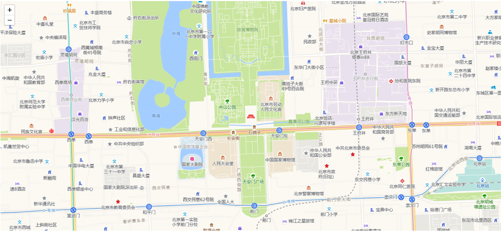

# :leaves: Leaflet 地图开发
## 一、应用场景

地图开发本质上是地图图层、标记、覆盖物等内容的开发。国内常见的地图服务商有百度、高德、腾讯等，常见的国外地图服务有谷歌地图、OMS等，基本上每种地图服务都提供有自己的一套地图 api ，如果项目中涉及到多种地图的使用时，就需要针对每种地图单独开发相应的地图代码，这对开发者并不是很友好。

Leaflet 是一个开源的地图 JavaScript 库，提供了地图开发所需的大部分相关组件，可实现地图相关业务需求的开发，为多地图源开发提供了统一的解决方案。Leaflet 本身并不提供地图内容，所以使用 leaflet 创建了地图之后，还需额外使用地图应用服务商去来加载相应的地图图层。

## 二、Leaflet 配置

在项目中使用 Leaflet，首先需要对其进行引入，可使用以下几种方式：

1. 从 [Leaflet 官网](https://leafletjs.com/download.html)下载相应版本到本地进行引入

   ```html
   <!-- 引入 Leaflet CSS 文件 -->
   <link rel="stylesheet" href="https://unpkg.com/leaflet@1.7.1/dist/leaflet.css" />
   <!-- 引入 Leaflet js 文件，注意必须在 CSS 文件引入后再进行引入 -->
   <script src="https://unpkg.com/leaflet@1.7.1/dist/leaflet.js"></script>
   ```

2. 使用 CDN 的方式进行引入，可使用以下一些 CDN: [unpkg](https://unpkg.com/browse/leaflet@1.7.1/dist/)、[cdnjs](https://cdnjs.com/libraries/leaflet)、[jsDelivr](https://www.jsdelivr.com/package/npm/leaflet?path=dist)，为避免潜在的安全性问题，leaflet 建议使用 CDN 进行引入时，启用子资源完整性 (SRI) 校验

   ```html
   <!-- 引入 Leaflet CSS 文件 -->
   <link rel="stylesheet" href="https://unpkg.com/leaflet@1.7.1/dist/leaflet.css" integrity="sha512-xodZBNTC5n17Xt2atTPuE1HxjVMSvLVW9ocqUKLsCC5CXdbqCmblAshOMAS6/keqq/sMZMZ19scR4PsZChSR7A==" crossorigin="" />
   <!-- 引入 Leaflet js 文件，注意必须在 CSS 文件引入后再进行引入 -->
   <script src="https://unpkg.com/leaflet@1.7.1/dist/leaflet.js" integrity="sha512-XQoYMqMTK8LvdxXYG3nZ448hOEQiglfqkJs1NOQV44cWnUrBc8PkAOcXy20w0vlaXaVUearIOBhiXZ5V3ynxwA==" crossorigin=""></script>
   ```

3. 使用 NPM 在项目中进行本地安装

   ```
   npm install leaflet --save
   ```

## 三、创建地图实例

1. 在 html 代码中设置高度不为 0 的地图容器

   ```html
   <div id="mapid" style="height: 700px;"></div>
   ```

2. 创建地图实例

   使用 `L.map() ` 方法可以在指定 DOM 节点渲染地图并返回创建的地图实例，`L.map(dom,options)` 接收两个参数，第1个参数为地图实例渲染的 DOM 信息，可为 DOM 元素，也可以为字符串时，为字符串时会自动在 id 值为该字符串的 DOM节点进行渲染渲染；第2个参数 `options` 为地图渲染时的初始配置信息。

   ```js
   var mymap = L.map('mapid', { attributionControl: false }); // 初始化地图
   mymap.setView([39.909187, 116.397451], 9); // 设置地图中心点、缩放比例
   // 加载高德地图图层贴片
   L.tileLayer('http://webrd0{s}.is.autonavi.com/appmaptile?x={x}&y={y}&z={z}&lang=zh_cn&size=1&scale=1&style=8', {
   	subdomains: "test",
   }).addTo(mymap);  
   ```

3. 实现效果

   


## 四、地图属性

以下为 Leaflet Map 一些基本的可配置项介绍 ([查看 Leaflet 官网完整配置信息](https://leafletjs.com/reference-1.7.1.html))，这些配置可在地图初始化时进行设置，也可以在地图初始化完成后调用相应方法进行修改。

|        属性        |                            类型                             |     默认值     | 描述                                                         |
| :----------------: | :---------------------------------------------------------: | :------------: | :----------------------------------------------------------- |
|    preferCanvas    |                           Boolean                           |     false      | 是否使用 Canvas 渲染器渲染器渲染矢量图路径，默认使用 svg 渲染器渲染 |
| attributionControl |                           Boolean                           |      true      | 是否显示地图右下角的 logo 属性                               |
|    zoomControl     |                           Boolean                           |      true      | 是否显示地图缩放控件                                         |
| closePopupOnClick  |                           Boolean                           |      true      | 点击地图时，关闭地图界面所有弹窗                             |
|      zoomSnap      |                           Number                            |       1        | 强制地图的缩放级别始终为该值的倍数                           |
|     zoomDelta      |                           Number                            |       1        | 设置地图缩放级别值变化多少后，刷新地图图层                   |
|    trackResize     |                           Boolean                           |      true      | 浏览器窗口大小调整后地图是否自动更新                         |
|      boxZoom       |                           Boolean                           |      true      | 通过按住Shift键的同时拖动鼠标，地图是否可以缩放到指定的矩形区域。 |
|      dragging      |                           Boolean                           |      true      | 地图是否可拖动                                               |
|        crs         |    [CRS](https://leafletjs.com/reference-1.7.1.html#crs)    | L.CRS.EPSG3857 | 地图所使用的坐标系                                           |
|       center       | [LatLng](https://leafletjs.com/reference-1.7.1.html#latlng) |   undefined    | 地图的初始地理中心点                                         |
|        zoom        |                           Number                            |   undefined    | 地图初始缩放级别                                             |
|      minZoom       |                           Number                            |       *        | 地图最小缩放级别                                             |
|      maxZoom       |                           Number                            |       *        | 地图最大缩放级别                                             |
|       layers       |                            Array                            |       []       | 地图贴片图层数组                                             |
|   zoomAnimation    |                           Boolean                           |      true      | 是否启用地图缩放动画                                         |
|      inertia       |                           Boolean                           |       *        | 是否启动惯性平移效果                                         |
|  scrollWheelZoom   |                       Boolean\|String                       |      true      | 使用鼠标滚轮是否可以缩放地图。如果值为`'center'`，则无论鼠标在何处，它都会缩放到视图的中心。 |
|        tap         |                           Boolean                           |      true      | 手指双击触屏放大地图                                         |
|     touchZoom      |                       Boolean\|String                       |      true      | 用两根手指触摸拖动是否可以缩放地图，如果值为`'center'`，默认放大地图中心点位置。 |

### 五、地图事件

